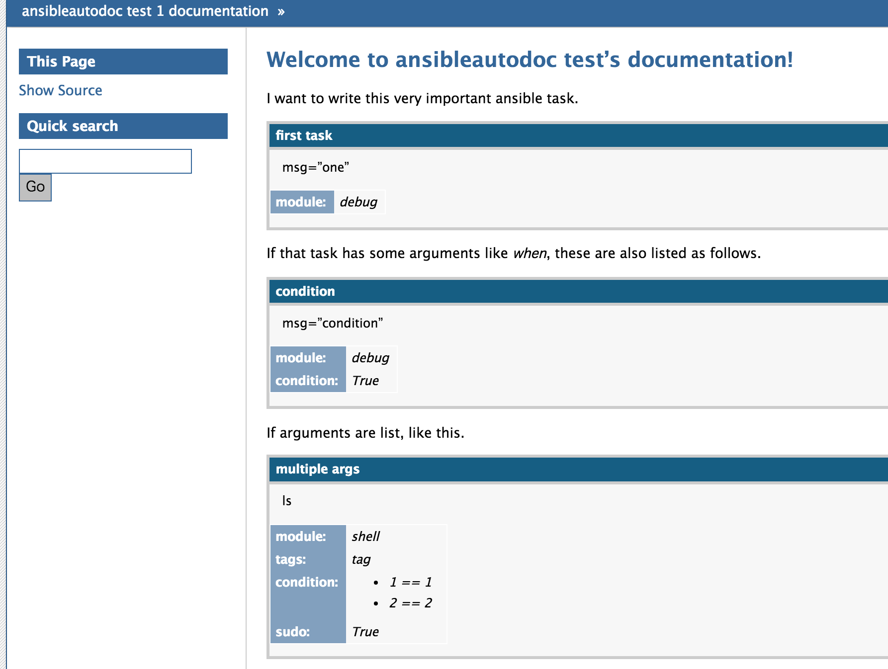

sphinxcontrib-ansibleautodoc
================================================

`sphinxcontrib-ansibleautodoc` is an sphinx extension which can search task in ansible playbook and generate document.

install
----------------

::

  pip install sphinxcontrib-ansibleautodoc


and add `'sphinxcontrib.ansibleautodoc'` in extensions in your conf.py.

::

   extensions = [
       'sphinxcontrib.ansibleautodoc',
   ]


How to use
------------------------

Currently there is one directive called `ansibleautotask`.

ansibleautotask
````````````````````````````````````

::

  .. ansibleautotask:: second task
     :playbook: ../ansible/web.yml

The contents of this directive is an ansible task name. If task does not have a name, directive can not find.

`playbook` option is for specify initial ansible playbook. ansibleautodoc scan the playbook and read include and roles as followes. So you need only one playbook file.


Output Example
--------------------



Related
----------

Ansible
  https://ansible.com

License
-------------

2-clause BSD License

